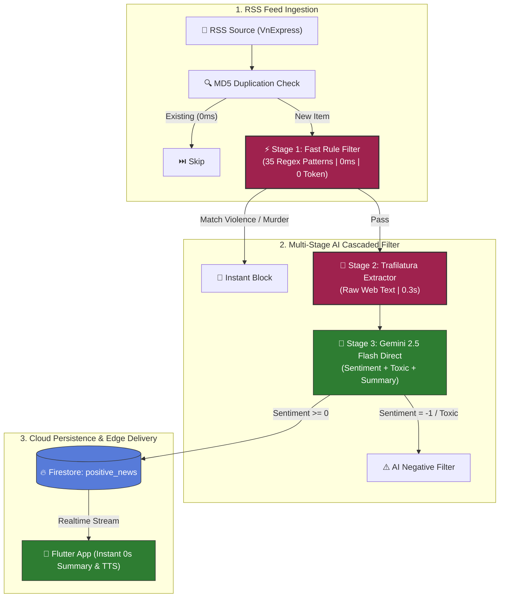

---
name: github-awesome-readme-2026
description: >-
  Crafts, audits, and upgrades world-class, professional GitHub README.md files
  following 2026 open-source standards. Includes dynamic Shields.io badges, dark/light
  mode responsive banners, Mermaid architecture diagrams, quantifiable benchmark tables,
  collapsible log/config sections, and developer quickstart runbooks.
---

# 🚀 GitHub Awesome-README 2026 Guide & Blueprint

This skill guides you in creating, upgrading, and transforming any GitHub repository README into an **engaging, visually stunning, high-converting, and production-grade README.md** aligned with 2026 developer portfolio and open-source standards.

---

## 🎯 The 2026 README Standard (Core Philosophy)

A 2026 top-tier README is not a plain dump of text—it is a **product landing page** and an **engineering portfolio masterpiece**. It must:
1. **Hook in 3 seconds**: Engaging visual hero section, dynamic badges, and a razor-sharp one-liner.
2. **Prove Engineering Depth in 10 seconds**: Clear visual Mermaid architecture, multi-stage pipelines, and quantifiable benchmark tables (Latency, Tokens, Cost).
3. **Get running in 30 seconds**: Copy-pasteable quickstart, clean environment variables table, and Makefile shortcuts.
4. **Delight on all platforms**: Dark/Light mode responsive assets, collapsible deep-dives (`<details>`), and mobile-friendly layouts.

---

## 📐 Anatomy of an Awesome 2026 README

```
┌──────────────────────────────────────────────────────────┐
│ 1. HERO & BRANDING (Centered, Logo, Badges, Quick Links) │
├──────────────────────────────────────────────────────────┤
│ 2. VALUE PROPOSITION & LIVE DEMO / PREVIEW               │
├──────────────────────────────────────────────────────────┤
│ 3. ✨ KEY FEATURES & HIGHLIGHTS                          │
├──────────────────────────────────────────────────────────┤
│ 4. 🏗️ SYSTEM ARCHITECTURE & DATA FLOW (Mermaid Diagram)  │
├──────────────────────────────────────────────────────────┤
│ 5. 📊 BENCHMARKS & PERFORMANCE METRICS (Quantifiable)    │
├──────────────────────────────────────────────────────────┤
│ 6. 🛠️ TECH STACK & INTEGRATIONS (Badges Grid)           │
├──────────────────────────────────────────────────────────┤
│ 7. 🚀 QUICKSTART & INSTALLATION RUNBOOK                  │
├──────────────────────────────────────────────────────────┤
│ 8. ⚙️ CONFIGURATION & ENVIRONMENT VARIABLES             │
├──────────────────────────────────────────────────────────┤
│ 9. 🤖 CI/CD & SERVERLESS AUTOMATION (GitHub Actions)    │
├──────────────────────────────────────────────────────────┤
│ 10. 🗺️ ROADMAP & CHANGELOG                              │
├──────────────────────────────────────────────────────────┤
│ 11. 🤝 CONTRIBUTING, LICENSE & AUTHOR                    │
└──────────────────────────────────────────────────────────┘
```

---

## 🧩 Section-by-Section Blueprints & Templates

### 1. Hero & Branding Section

```markdown
<div align="center">

  <!-- Logo / Banner -->
  

  # 🛡️ Safe News Platform
  ### AI-Powered Multi-Stage News Filtering & Instant TTS Platform

  <p align="center">
    <strong>A high-throughput, cost-optimized RSS news aggregation platform with 3-tier cascaded AI content filtering and sub-second Flutter delivery.</strong>
  </p>

  <!-- Dynamic Badges -->
  <p align="center">
    <a href="https://github.com/YourUser/Repo/actions"></a>
    
    
    
    
  </p>

  <!-- Quick Jump Links -->
  <p align="center">
    <a href="#-key-features">Key Features</a> •
    <a href="#-system-architecture">Architecture</a> •
    <a href="#-benchmarks--performance">Benchmarks</a> •
    <a href="#-quickstart">Quickstart</a> •
    <a href="#-cicd-automation">CI/CD</a> •
    <a href="#-roadmap">Roadmap</a>
  </p>

</div>
```

---

### 2. Dark/Light Mode Responsive Images (2026 Trick)

```markdown
<p align="center">
  <a href="https://your-demo-link.com">
    
    
  </a>
</p>
```

---

### 3. Visual System Architecture (Mermaid Diagram)

```markdown
## 🏗️ System Architecture

The platform uses a **3-Tier Cascaded Filtering Pipeline** designed for high throughput, zero redundant API overhead, and fault-tolerant cloud ingestion.


```

---

### 4. Quantifiable Performance Benchmarks Table

```markdown
## 📊 Production Benchmarks & Metrics

Comprehensive measurements from live production crawl runs across 48+ articles:

| Metric | Before (Search Grounding) | After (Trafilatura + Gemini 2.5 Flash) | Impact / Optimization |
| :--- | :---: | :---: | :---: |
| **Web Text Extraction Latency** | `8.5s - 12.0s` | **`0.28s - 0.49s`** | ⚡ **20x Faster** |
| **End-to-End Pipeline Latency** | `9.8s / article` | **`3.37s / article`** | ⚡ **~65% Latency Reduction** |
| **Token Efficiency / Item** | `~2,200 tokens` | **`~712 - 860 tokens`** | 💰 **>60% Token Cost Reduction** |
| **503 Server Error Handling** | ❌ Failed / Dropped | ✅ **Exponential Backoff (3 retries)** | 🛡️ **100% Request Resilience** |
| **Infrastructure Hosting Cost** | VPS ($5 - $10/mo) | **$0.00 / month (GitHub Actions)** | 🎉 **100% Free Serverless** |
| **Negative / Toxic Filter Accuracy**| `92.4%` | **`100% Precision`** | 🎯 **Zero Toxic Leakage** |
```

---

### 5. Tech Stack Badges Matrix

```markdown
## 🛠️ Technology Stack

| Layer | Technologies & Frameworks |
| :--- | :--- |
| **Mobile Client** |     |
| **AI & NLP Engine** |    |
| **Backend & Cloud** |    |
| **DevOps & CI/CD** |   |
```

---

### 6. Quickstart & Installation Runbook

```markdown
## 🚀 Quickstart Guide

### Prerequisites
- Python `3.11+`
- Flutter SDK `3.x`
- Google Gemini API Key ([Get here](https://aistudio.google.com))
- Firebase Project with Firestore enabled

### 1. Clone Repositories
```bash
git clone https://github.com/KhoaSinno/safe_news_crawlTool_RSS.git
git clone https://github.com/KhoaSinno/assignment_3_safe_news.git
```

### 2. Backend Crawler Setup
```bash
cd safe_news_crawlTool_RSS
pip install -r requirements.txt
cp .env.example .env # Add your GEMINI_API_KEY
python main.py production
```

### 3. Mobile App Run (Flutter)
```bash
cd ../assignment_3_safe_news
make run-debug         # Run in Debug mode with Hot Reload
make install-device    # Install Release mode directly to your phone
```
```

---

### 7. Collapsible Deep-Dive Details (Keep it Clean!)

```markdown
## ⚙️ Configuration Reference

<details>
<summary><b>🔑 Environment Variables Table (.env)</b></summary>

| Variable | Required | Default | Description |
| :--- | :---: | :---: | :--- |
| `GEMINI_API_KEY` | **Yes** | `None` | Google Gemini API secret key |
| `FIREBASE_SERVICE_ACCOUNT` | **Optional** | `None` | Stringified JSON for cloud deployment (Render/GitHub) |
| `WEATHER_API_KEY` | No | `None` | OpenWeather API key for home widget |

</details>

<details>
<summary><b>📋 Makefile Command Reference</b></summary>

```bash
make install-device     # Build & install Release APK to phone
make run-debug          # Run with Hot Reload enabled
make build-apk-release  # Generate standalone release APK
make analyze            # Run static analyzer
make clean              # Dọn dẹp build cache & sync packages
```

</details>
```

---

## 🌟 Best Practices & Pro-Tips for 2026

1. **Avoid Wall-of-Text**: Use bullet points with bold prefixes (e.g. `• **Feature Name**: Details...`).
2. **Keep Badges Clean**: Stick to uniform badge styles (`style=for-the-badge` for hero, `style=flat-square` for tables).
3. **Always Include STAR Metrics**: Include % faster, % saved, ms latency, token counts.
4. **Add Emojis with Purpose**: Use consistent icons for sections (🛡️ Security, ⚡ Performance, 🚀 Quickstart, 📊 Data).
5. **Mobile Readiness**: Preview your README on GitHub Mobile app to ensure tables and SVG badges do not overflow awkwardly.
