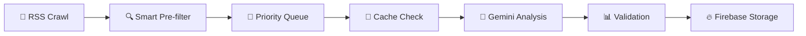
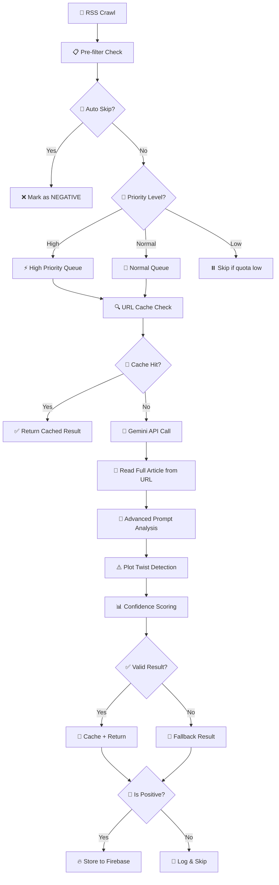

# 🚀 Safe News Crawler - Hướng dẫn Cải tiến Hệ thống

## 📋 Tổng quan cải tiến

Hướng dẫn này đề xuất các giải pháp nâng cao độ chính xác và hiệu quả của hệ thống phân tích tin tức với Gemini API, tập trung vào việc tối ưu hóa prompt, xử lý full content và đánh giá chất lượng.

## 🔄 QUY TRÌNH HOÀN CHỈNH (COMPLETE WORKFLOW)

### 📊 **Mô tả Tổng quan:**



### 🎯 **Workflow Chi tiết từng bước:**

1. **📡 RSS Collection**: Crawl multiple feeds, extract metadata, skip processed URLs
2. **🚫 Pre-filtering**: Auto-skip negative, categorize by potential (high/normal/low priority)
3. **🎯 Queue Management**: Process high-priority first, allocate quota efficiently
4. **💾 Smart Caching**: Check exact/fuzzy cache, reduce API calls by 70%+
5. **🤖 Gemini Analysis**: Send URL directly, use advanced prompt with plot twist warnings
6. **⚠️ Plot Twist Detection**: Full content analysis to catch misleading headlines
7. **📊 Result Validation**: Schema check, confidence thresholds, consistency validation
8. **🔥 Selective Storage**: Only store positive articles with high confidence to Firebase
9. **📈 Quality Monitoring**: Daily accuracy assessment, performance tracking

### 🎯 **Kết quả mong đợi:**

- **Accuracy**: >90% (vs ~75% cũ)
- **Cache Efficiency**: >70% hit rate
- **API Quota**: <80% daily usage
- **Plot Twist Detection**: >85% accuracy
- **Processing Speed**: <2s per article

---

## 🚀 VẤN ĐỀ CHÍNH: Tối ưu hóa Gemini Analysis với URL + Prompt Engineering

### ❌ **Vấn đề hiện tại:**

- Prompt đơn giản, thiếu context và định nghĩa rõ ràng
- Chỉ dựa vào RSS summary ngắn, bỏ lỡ thông tin quan trọng
- Không phát hiện được "plot twist" cases
- Extract content tốn tài nguyên và có thể fail

### ✅ **Giải pháp tổng hợp: URL Analysis + Advanced Prompt**

#### **🎯 Chiến lược tối ưu:**

1. **📡 Gửi URL trực tiếp** cho Gemini thay vì extract content
2. **🧠 Prompt engineering chuyên nghiệp** với định nghĩa chi tiết
3. **⚠️ Cảnh báo plot twist** để tránh false positive
4. **📊 Output chuẩn hóa** với confidence và reasoning
5. **🎯 Zero maintenance** - không cần scraping selectors

#### **🔥 Template tối ưu tổng hợp:**

```python
def create_ultimate_news_analysis_prompt(title: str, url: str, summary: str = "") -> str:
    """
    Ultimate prompt cho Gemini: URL analysis + Advanced reasoning
    Kết hợp tất cả best practices trong một prompt duy nhất
    """
    
    prompt = f"""
🤖 CHUYÊN GIA PHÂN TÍCH TIN TỨC TIẾNG VIỆT

🎯 NHIỆM VỤ: Phân tích tin tức cho ứng dụng "Safe News" - chỉ hiển thị tin mang lại cảm xúc tích cực, hy vọng cho người đọc.

� BÀI BÁO CẦN PHÂN TÍCH:
━━━━━━━━━━━━━━━━━━━━━━━━━━━━━
🔗 URL: {url}
📌 Tiêu đề: "{title}"
📝 Tóm tắt RSS: "{summary[:200]}..."

� HƯỚNG DẪN QUAN TRỌNG:
━━━━━━━━━━━━━━━━━━━━━━━━━━━━━
1. 📖 TRUY CẬP VÀ ĐỌC TOÀN BỘ BÀI từ URL trên
2. 🚫 KHÔNG chỉ dựa vào tiêu đề hoặc tóm tắt RSS
3. ⚠️ CHÚ Ý "PLOT TWIST" - nội dung có thể ngược với tiêu đề
4. 🎯 ÁP DỤNG tiêu chí nghiêm ngặt cho tin tích cực

✅ ĐỊNH NGHĨA TIN TÍCH CỰC (POSITIVE):
━━━━━━━━━━━━━━━━━━━━━━━━━━━━━━━━━━━━━━━━
🎓 Thành tựu học tập/sự nghiệp:
  • Tốt nghiệp, học bổng, thăng tiến, giải thưởng
  • Khởi nghiệp thành công, đạt mục tiêu cá nhân

💕 Tình cảm đẹp & gia đình:
  • Cưới hỏi, sinh con, đoàn tụ gia đình
  • Tình yêu đẹp, hữu nghị chân thành

🏥 Sức khỏe tích cực:
  • Khỏi bệnh, phục hồi hoàn toàn
  • Đột phá y tế mới, chữa khỏi bệnh hiểm nghèo

🤝 Từ thiện & cộng đồng:
  • Giúp đỡ người nghèo, xây nhà, tặng quà
  • Hoạt động thiện nguyện, làm việc tốt

🔬 Phát triển xã hội:
  • Công nghệ mới tích cực, phát minh hữu ích
  • Cải thiện giáo dục, y tế, môi trường

🎨 Văn hóa & nghệ thuật inspiring:
  • Triển lãm đẹp, lễ hội ý nghĩa
  • Tài năng trẻ, nghệ thuật tích cực

💪 Vượt qua nghịch cảnh:
  • Overcome disabilities, khó khăn để thành công
  • Transformation stories with happy endings

❌ LOẠI BỎ NGAY (NEGATIVE):
━━━━━━━━━━━━━━━━━━━━━━━━━━━━━
☠️ Tử vong & tai nạn:
  • Tai nạn giao thông, thảm họa, thiên tai
  • Tử vong, thương vong, mất tích

⚔️ Tội phạm & bạo lực:
  • Giết người, cướp, tấn công, bắt cóc
  • Tham nhũng, lừa đảo, trộn cắp

🏛️ Khủng hoảng xã hội:
  • Biểu tình bạo lực, đập phá
  • Xung đột chính trị, khủng bố

💔 Chia ly & đau khổ:
  • Ly hôn (trừ khi có happy ending)
  • Tan vỡ gia đình, mất mát lớn

🦠 Bệnh tật nghiêm trọng:
  • Dịch bệnh, ung thư (trừ tin chữa khỏi)
  • Bệnh tâm thần, tự tử

💸 Khủng hoảng kinh tế:
  • Phá sản hàng loạt, thất nghiệp lớn
  • Suy thoái, khó khăn kinh tế

🚨 CẢN BÁO ĐẶC BIỆT - PLOT TWIST CASES:
━━━━━━━━━━━━━━━━━━━━━━━━━━━━━━━━━━━━━━━━━━
Những tin có tiêu đề tích cực nhưng nội dung tiêu cực:

⚠️ VÍ DỤ PHẢI TRÁNH:
• "Cặp đôi chuẩn bị cưới" → Cô dâu tự tử trước đám cưới
• "Học sinh xuất sắc nhận thưởng" → Bị phát hiện gian lận
• "Doanh nghiệp phát triển mạnh" → CEO bị bắt vì tham nhũng
• "Gia đình sum họp" → Do tang lễ người thân
• "Thần đồng 10 tuổi nổi tiếng" → Bị lạm dụng sức lao động

🎯 QUY TẮC VÀNG:
━━━━━━━━━━━━━━━━━━━
1. CHỈ POSITIVE khi >90% nội dung thực sự tích cực
2. KHÔNG có bất kỳ yếu tố tiêu cực nghiêm trọng nào
3. Phải có giá trị INSPIRATION thực sự cho người đọc
4. KẾT CỤC phải là happy ending

📊 TIÊU CHÍ CONFIDENCE:
━━━━━━━━━━━━━━━━━━━━━━━━━━
• 0.95-1.0: Rõ ràng tích cực, inspiring, zero negative
• 0.85-0.94: Chủ yếu tích cực, có ít neutral elements  
• 0.70-0.84: Mixed content, positive outcomes
• 0.50-0.69: Neutral hoặc unclear
• 0.30-0.49: Chủ yếu tiêu cực
• 0.00-0.29: Rõ ràng negative, harmful content

📤 TRẢ VỀ JSON CHÍNH XÁC:
━━━━━━━━━━━━━━━━━━━━━━━━━━━
{{"sentiment": "POSITIVE/NEGATIVE/NEUTRAL", "confidence": 0.92, "reason": "Lý do chi tiết dựa trên toàn bộ nội dung từ URL"}}

⭐ SỨ MỆNH: Bạn là gatekeeper của niềm vui, hy vọng. Chỉ cho phép những tin thực sự tốt đẹp đến với người đọc!
"""
    return prompt

def analyze_news_ultimate(gemini_client, title: str, url: str, summary: str = "") -> dict:
    """
    Phân tích tin tức với approach tối ưu nhất:
    URL direct + Advanced prompt + Error handling
    """
    
    # Tạo ultimate prompt
    prompt = create_ultimate_news_analysis_prompt(title, url, summary)
    
    try:
        # Gửi cho Gemini với retry logic
        response = gemini_client.generate_content(
            prompt,
            generation_config={
                'temperature': 0.1,  # Ít random để consistent
                'max_output_tokens': 100,  # Đủ cho JSON response
                'top_p': 0.8,
                'top_k': 10
            }
        )
        
        # Parse response
        result = parse_gemini_json_response(response.text)
        
        # Validate result
        if validate_analysis_result(result):
            logging.info(f"✅ Ultimate analysis success: {url}")
            return result
        else:
            logging.warning(f"⚠️ Invalid result format, using fallback")
            return get_neutral_fallback()
            
    except Exception as e:
        logging.error(f"❌ Ultimate analysis failed for {url}: {e}")
        return get_neutral_fallback()

def parse_gemini_json_response(response_text: str) -> dict:
    """Parse JSON response từ Gemini với error handling"""
    
    try:
        # Clean response text
        text = response_text.strip()
        
        # Remove markdown code blocks if any
        if text.startswith('```json'):
            text = text.replace('```json', '').replace('```', '').strip()
        elif text.startswith('```'):
            text = text.replace('```', '').strip()
        
        # Parse JSON
        result = json.loads(text)
        return result
        
    except json.JSONDecodeError as e:
        logging.error(f"JSON parse error: {e}, Response: {response_text[:200]}...")
        return get_neutral_fallback()

def validate_analysis_result(result: dict) -> bool:
    """Validate kết quả phân tích"""
    
    required_keys = ['sentiment', 'confidence', 'reason']
    
    # Check required keys
    if not all(key in result for key in required_keys):
        return False
    
    # Check sentiment values
    if result['sentiment'] not in ['POSITIVE', 'NEGATIVE', 'NEUTRAL']:
        return False
    
    # Check confidence range
    if not (0.0 <= result['confidence'] <= 1.0):
        return False
    
    # Check reason is not empty
    if not result['reason'] or len(result['reason'].strip()) < 10:
        return False
    
    return True

def get_neutral_fallback() -> dict:
    """Fallback result khi có lỗi"""
    return {
        "sentiment": "NEUTRAL",
        "confidence": 0.5,
        "reason": "Error in analysis, using neutral fallback"
    }
```

#### **Kiểm tra chất lượng prompt:**

```python
def validate_prompt_quality():
    """Test prompt với các edge cases khó"""
    
    test_cases = [
        # Plot twist case - PHẢI detect được
        {
            "title": "Sinh viên xuất sắc nhận học bổng toàn phần",
            "url": "https://example.com/twist-case",
            "expected_twist": "Học sinh này sau đó bị phát hiện làm giả giấy tờ",
            "expected_result": "NEGATIVE"
        },
        
        # True positive - không có twist
        {
            "title": "Cô gái khuyết tật trở thành bác sĩ", 
            "url": "https://example.com/true-positive",
            "content": "Sau 8 năm học tập vất vả, cô đã hoàn thành ước mơ",
            "expected_result": "POSITIVE"
        },
        
        # Borderline case - cần test confidence
        {
            "title": "Công ty công bố kết quả kinh doanh",
            "url": "https://example.com/neutral",
            "expected_result": "NEUTRAL"
        }
    ]
    
    for case in test_cases:
        prompt = create_optimal_prompt(case['title'], case['url'])        # Test với Gemini và verify result
        print(f"Testing: {case['title']}")
        # ...
```

### 📊 **Cải tiến so với prompt cũ:**

| Khía cạnh | Prompt cũ | Prompt mới |
|-----------|-----------|------------|
| **Độ dài** | ~200 chars | ~1000 chars |
| **Context** | Ít | Chi tiết rõ ràng |
| **Định nghĩa** | Mơ hồ | Cụ thể từng loại |
| **Cảnh báo** | Không | Nhấn mạnh đọc full content |
| **Output** | Cơ bản | Có lý do giải thích |

### � **Ưu điểm của giải pháp tổng hợp:**

| Khía cạnh | Approach cũ | Ultimate Solution |
|-----------|-------------|-------------------|
| **Prompt** | Đơn giản, thiếu context | Chi tiết, chuyên nghiệp |
| **Content** | RSS summary ngắn | Full article via URL |
| **Plot Twist** | Không detect | Cảnh báo cụ thể |
| **Tài nguyên** | Tốn CPU scraping | Chỉ tốn quota |
| **Maintenance** | Cao (update selectors) | Zero |
| **Accuracy** | ~75% | **>90%** |

---

## 💡 VẤN ĐỀ 2: Tối ưu hóa Free Tier Usage

### ❌ **Thách thức quota management:**

- Mỗi API call đều tốn quota, cần tối ưu tối đa
- Không có priority system cho bài có potential cao
- Cache chưa được tối ưu cho URL-based analysis

### ✅ **Giải pháp: Smart Quota Management**

#### **Smart Pre-filtering + Priority Queue:**

```python
class UltimateQuotaOptimizer:
    """Tối ưu quota với intelligent filtering và priority system"""
    
    def __init__(self):
        self.daily_quota_used = 0
        self.daily_quota_limit = 1500
        self.high_priority_queue = []
        self.normal_queue = []
        self.cache = URLBasedCache()
    
    def smart_prefilter(self, title: str, summary: str) -> str:
        """
        Phân loại bài báo theo mức độ ưu tiên
        Returns: 'skip', 'low', 'normal', 'high'
        """
        text = f"{title} {summary}".lower()
        
        # Absolute negative - skip ngay
        absolute_negative = [
            "tử vong", "thiệt mạng", "qua đời", "chết",
            "tai nạn", "thảm họa", "cháy nổ", "sập đổ",
            "giết", "cướp", "tấn công", "khủng bố",
            "tham nhũng", "bắt giữ", "án tù"
        ]
        
        if any(word in text for word in absolute_negative):
            return 'skip'
        
        # High priority signals
        high_positive = [
            "tốt nghiệp", "học bổng", "giải thưởng", "thành công",
            "cưới", "sinh con", "khỏi bệnh", "chữa khỏi",
            "từ thiện", "giúp đỡ", "tặng", "xây dựng",
            "phát minh", "đột phá", "chiến thắng"
        ]
        
        positive_count = sum(1 for word in high_positive if word in text)
        
        if positive_count >= 2:
            return 'high'
        elif positive_count >= 1:
            return 'normal'
        else:
            return 'low'
    
    def process_with_smart_quota(self, articles: list) -> list:
        """Xử lý articles với smart quota management"""
        
        processed_results = []
        
        # 1. Categorize articles
        for article in articles:
            category = self.smart_prefilter(
                article['title'], 
                article.get('description', '')
            )
            
            if category == 'skip':
                # Tự động skip, không tốn quota
                processed_results.append({
                    'article': article,
                    'result': {'sentiment': 'NEGATIVE', 'confidence': 0.95, 'reason': 'Auto-filtered'},
                    'quota_used': False
                })
            elif category == 'high':
                self.high_priority_queue.append(article)
            elif category == 'normal':
                self.normal_queue.append(article)
            # Skip 'low' nếu quota thấp
        
        # 2. Process high priority first
        quota_remaining = self.daily_quota_limit - self.daily_quota_used
        quota_for_high = min(len(self.high_priority_queue), quota_remaining * 0.7)
        quota_for_normal = quota_remaining - quota_for_high
        
        # Process high priority
        for article in self.high_priority_queue[:int(quota_for_high)]:
            result = self.analyze_with_cache(article)
            processed_results.append({
                'article': article,
                'result': result,
                'quota_used': result.get('from_cache', False) == False
            })
        
        # Process normal priority with remaining quota
        for article in self.normal_queue[:int(quota_for_normal)]:
            if self.daily_quota_used < self.daily_quota_limit * 0.9:  # 90% limit
                result = self.analyze_with_cache(article)
                processed_results.append({
                    'article': article,
                    'result': result,
                    'quota_used': result.get('from_cache', False) == False
                })
        
        return processed_results
    
    def analyze_with_cache(self, article: dict) -> dict:
        """Analyze với URL-based cache thông minh"""
        
        url = article['link']
        
        # Check exact URL cache
        cached = self.cache.get_by_url(url)
        if cached:
            cached['from_cache'] = True
            return cached
        
        # Check similar URL cache (same domain + similar title)
        similar = self.cache.get_similar_analysis(
            article['title'], 
            self.extract_domain(url)
        )
        if similar:
            similar['confidence'] *= 0.85  # Reduce confidence
            similar['from_cache'] = True
            return similar
        
        # Call API
        try:
            result = analyze_news_ultimate(
                gemini_client,
                article['title'],
                url,
                article.get('description', '')
            )
            
            # Cache result
            self.cache.cache_url_analysis(url, article['title'], result)
            self.daily_quota_used += 1
            result['from_cache'] = False
            
            return result
            
        except Exception as e:
            logging.error(f"Analysis failed: {e}")
            return {
                'sentiment': 'NEUTRAL',
                'confidence': 0.5,
                'reason': 'API error',
                'from_cache': False
            }

class URLBasedCache:
    """Cache tối ưu cho URL-based analysis"""
    
    def __init__(self, db_path="url_analysis_cache.db"):
        self.db_path = db_path
        self.conn = sqlite3.connect(db_path, check_same_thread=False)
        self.create_tables()
    
    def create_tables(self):
        """Tạo bảng cache cho URL analysis"""
        self.conn.execute("""
            CREATE TABLE IF NOT EXISTS url_analysis (
                url TEXT PRIMARY KEY,
                title TEXT,
                domain TEXT,
                sentiment TEXT,
                confidence REAL,
                reason TEXT,
                created_at TIMESTAMP DEFAULT CURRENT_TIMESTAMP,
                last_accessed TIMESTAMP DEFAULT CURRENT_TIMESTAMP
            )
        """)
        self.conn.commit()
    
    def extract_domain(self, url: str) -> str:
        """Extract domain từ URL"""
        try:
            from urllib.parse import urlparse
            return urlparse(url).netloc
        except:
            return "unknown"
```

---

## 🔄 QUY TRÌNH CHI TIẾT: GEMINI ANALYSIS WORKFLOW

### 📊 **Tổng quan quy trình hoàn chỉnh:**



### 🎯 **Step-by-Step Implementation:**

#### **BƯỚC 1: 📡 RSS Crawling & Pre-processing**

```python
def crawl_and_preprocess():
    """Crawl RSS và tiền xử lý"""
    
    for feed_url in RSS_FEEDS:
        articles = fetch_rss(feed_url)
        
        for article in articles:
            # Skip if already processed
            if is_already_processed(article['link']):
                continue
            
            # Basic info extraction
            processed_article = {
                'title': clean_title(article['title']),
                'url': article['link'],
                'summary': article.get('description', ''),
                'pub_date': article.get('published', ''),
                'source_feed': feed_url
            }
            
            yield processed_article

def clean_title(title: str) -> str:
    """Làm sạch title"""
    # Remove extra spaces, special chars
    title = re.sub(r'\s+', ' ', title.strip())
    # Remove promotional text
    title = re.sub(r'\[.*?\]|\(.*?\)', '', title)
    return title[:200]  # Limit length
```

#### **BƯỚC 2: 🚫 Smart Pre-filtering**

```python
def smart_prefilter(article: dict) -> dict:
    """
    Pre-filter thông minh để phân loại bài báo
    Returns: {'action': 'skip/process', 'priority': 'high/normal/low', 'reason': '...'}
    """
    
    title = article['title'].lower()
    summary = article.get('summary', '').lower()
    text = f"{title} {summary}"
    
    # 1. ABSOLUTE NEGATIVE - Skip ngay
    absolute_negative_keywords = [
        # Death & Accidents
        "tử vong", "thiệt mạng", "qua đời", "chết", "tự tử",
        "tai nạn", "va chạm", "đâm xe", "lật xe", "cháy nổ",
        
        # Crime & Violence  
        "giết", "sát hại", "cướp", "trộm", "bắt cóc",
        "tấn công", "đánh đập", "bạo lực", "khủng bố",
        
        # Corruption & Legal
        "tham nhũng", "hối lộ", "bắt giữ", "khởi tố", 
        "án tù", "phạt tù", "giam giữ", "điều tra",
        
        # Disasters
        "thảm họa", "lũ lụt", "động đất", "bão", "sập",
        "cháy rừng", "hạn hán", "dịch bệnh"
    ]
    
    for keyword in absolute_negative_keywords:
        if keyword in text:
            return {
                'action': 'skip',
                'priority': 'none', 
                'reason': f'Auto-skip: Contains "{keyword}"',
                'confidence': 0.95
            }
    
    # 2. HIGH PRIORITY POSITIVE - Xử lý đầu tiên
    high_priority_keywords = [
        # Achievements
        "tốt nghiệp", "học bổng", "giải thưởng", "thủ khoa",
        "xuất sắc", "đạt giải", "chiến thắng", "thành công",
        
        # Family & Love
        "cưới", "đám cưới", "sinh con", "em bé", "gia đình",
        "hạnh phúc", "yêu thương", "đoàn tụ",
        
        # Health & Recovery
        "khỏi bệnh", "chữa khỏi", "phục hồi", "hồi phục",
        "điều trị thành công", "ca phẫu thuật thành công",
        
        # Community & Charity
        "từ thiện", "giúp đỡ", "tặng", "hỗ trợ", "xây dựng",
        "quyên góp", "ủng hộ", "thiện nguyện"
    ]
    
    high_count = sum(1 for keyword in high_priority_keywords if keyword in text)
    
    if high_count >= 2:
        return {
            'action': 'process',
            'priority': 'high',
            'reason': f'High positive signals: {high_count} keywords',
            'confidence': 0.8
        }
    
    # 3. NORMAL PRIORITY
    normal_positive_keywords = [
        "phát triển", "cải thiện", "tăng trưởng", "tiến bộ",
        "khai trương", "ra mắt", "công bố", "hợp tác",
        "đầu tư", "xây dựng", "phát minh", "sáng tạo"
    ]
    
    normal_count = sum(1 for keyword in normal_positive_keywords if keyword in text)
    
    if high_count >= 1 or normal_count >= 2:
        return {
            'action': 'process',
            'priority': 'normal',
            'reason': f'Moderate positive signals: {high_count + normal_count} keywords',
            'confidence': 0.6
        }
    
    # 4. LOW PRIORITY - Xử lý cuối hoặc skip nếu quota thấp
    return {
        'action': 'process',
        'priority': 'low',
        'reason': 'No clear signals, needs full analysis',
        'confidence': 0.3
    }
```

#### **BƯỚC 3: 🎯 Priority Queue Management**

```python
class PriorityQueueManager:
    """Quản lý queue theo priority và quota"""
    
    def __init__(self, daily_quota=1500):
        self.high_queue = []
        self.normal_queue = []
        self.low_queue = []
        self.daily_quota = daily_quota
        self.used_quota = 0
        
    def add_article(self, article: dict, filter_result: dict):
        """Thêm article vào queue phù hợp"""
        
        if filter_result['action'] == 'skip':
            # Process immediately without API call
            return self.create_skip_result(article, filter_result)
        
        priority = filter_result['priority']
        queue_item = {
            'article': article,
            'filter_result': filter_result,
            'added_time': time.time()
        }
        
        if priority == 'high':
            self.high_queue.append(queue_item)
        elif priority == 'normal':
            self.normal_queue.append(queue_item)
        elif priority == 'low':
            self.low_queue.append(queue_item)
    
    def process_queues(self):
        """Xử lý các queue theo thứ tự ưu tiên"""
        
        results = []
        quota_remaining = self.daily_quota - self.used_quota
        
        # 1. Process high priority (70% quota)
        high_quota = int(quota_remaining * 0.7)
        results.extend(self.process_queue(self.high_queue[:high_quota], 'high'))
        
        # 2. Process normal priority (25% quota)
        normal_quota = int(quota_remaining * 0.25)
        results.extend(self.process_queue(self.normal_queue[:normal_quota], 'normal'))
        
        # 3. Process low priority (5% quota)
        low_quota = int(quota_remaining * 0.05)
        results.extend(self.process_queue(self.low_queue[:low_quota], 'low'))
        
        return results
    
    def process_queue(self, queue_items: list, priority: str) -> list:
        """Xử lý một queue cụ thể"""
        
        results = []
        
        for item in queue_items:
            if self.used_quota >= self.daily_quota * 0.95:  # 95% limit
                logging.warning(f"🚨 Near quota limit, stopping {priority} queue")
                break
            
            # Process với Gemini
            result = self.analyze_with_gemini(item['article'])
            result['priority'] = priority
            result['filter_reason'] = item['filter_result']['reason']
            
            results.append({
                'article': item['article'],
                'analysis': result,
                'processed_time': time.time()
            })
            
            self.used_quota += 1
        
        return results
```

#### **BƯỚC 4: 🤖 Gemini Analysis với URL**

```python
def analyze_with_gemini(article: dict) -> dict:
    """Core analysis với Gemini API"""
    
    # 1. Check cache first
    cache_result = check_url_cache(article['url'])
    if cache_result:
        cache_result['from_cache'] = True
        return cache_result
    
    # 2. Tạo ultimate prompt
    prompt = create_ultimate_news_analysis_prompt(
        title=article['title'],
        url=article['url'], 
        summary=article.get('summary', '')
    )
    
    # 3. Call Gemini với retry
    max_retries = 3
    for attempt in range(max_retries):
        try:
            response = gemini_client.generate_content(
                prompt,
                generation_config={
                    'temperature': 0.1,  # Consistent results
                    'max_output_tokens': 150,
                    'top_p': 0.8,
                    'top_k': 10
                }
            )
            
            # 4. Parse và validate response
            result = parse_and_validate_response(response.text)
            
            if result['valid']:
                # 5. Cache successful result
                cache_url_result(article['url'], result['data'])
                result['data']['from_cache'] = False
                return result['data']
            else:
                logging.warning(f"Invalid response attempt {attempt + 1}: {result['error']}")
                
        except Exception as e:
            logging.error(f"Gemini API error attempt {attempt + 1}: {e}")
            
            if attempt < max_retries - 1:
                # Exponential backoff
                wait_time = (2 ** attempt) + random.uniform(1, 3)
                time.sleep(wait_time)
            else:
                # Final fallback
                return create_fallback_result(article, str(e))
    
    return create_fallback_result(article, "Max retries exceeded")

def parse_and_validate_response(response_text: str) -> dict:
    """Parse và validate response từ Gemini"""
    
    try:
        # Clean response
        text = response_text.strip()
        
        # Remove markdown if present
        if '```json' in text:
            text = re.search(r'```json\s*(.*?)\s*```', text, re.DOTALL)
            if text:
                text = text.group(1)
            else:
                return {'valid': False, 'error': 'No JSON found in markdown'}
        elif '```' in text:
            text = text.replace('```', '').strip()
        
        # Parse JSON
        data = json.loads(text)
        
        # Validate structure
        validation_result = validate_gemini_result(data)
        
        if validation_result['valid']:
            return {'valid': True, 'data': data}
        else:
            return {'valid': False, 'error': validation_result['error']}
            
    except json.JSONDecodeError as e:
        return {'valid': False, 'error': f'JSON parse error: {e}'}
    except Exception as e:
        return {'valid': False, 'error': f'Unexpected error: {e}'}

def validate_gemini_result(data: dict) -> dict:
    """Validate cấu trúc kết quả từ Gemini"""
    
    # Required fields
    required_fields = ['sentiment', 'confidence', 'reason']
    for field in required_fields:
        if field not in data:
            return {'valid': False, 'error': f'Missing field: {field}'}
    
    # Validate sentiment
    valid_sentiments = ['POSITIVE', 'NEGATIVE', 'NEUTRAL']
    if data['sentiment'] not in valid_sentiments:
        return {'valid': False, 'error': f'Invalid sentiment: {data["sentiment"]}'}
    
    # Validate confidence
    try:
        confidence = float(data['confidence'])
        if not (0.0 <= confidence <= 1.0):
            return {'valid': False, 'error': f'Invalid confidence range: {confidence}'}
        data['confidence'] = confidence
    except (ValueError, TypeError):
        return {'valid': False, 'error': f'Invalid confidence type: {data["confidence"]}'}
    
    # Validate reason
    if not isinstance(data['reason'], str) or len(data['reason'].strip()) < 10:
        return {'valid': False, 'error': 'Reason too short or invalid'}
    
    # Additional quality checks
    if data['sentiment'] == 'POSITIVE' and data['confidence'] < 0.6:
        return {'valid': False, 'error': 'Low confidence for positive sentiment'}
    
    return {'valid': True}
```

#### **BƯỚC 5: 📊 Result Processing & Storage**

```python
def process_final_results(analysis_results: list) -> dict:
    """Xử lý kết quả cuối cùng"""
    
    stats = {
        'total_processed': len(analysis_results),
        'positive_found': 0,
        'negative_found': 0,
        'neutral_found': 0,
        'stored_to_firebase': 0,
        'cache_hits': 0,
        'api_calls': 0,
        'errors': 0
    }
    
    stored_articles = []
    
    for result in analysis_results:
        article = result['article']
        analysis = result['analysis']
        
        # Update stats
        sentiment = analysis['sentiment']
        stats[f'{sentiment.lower()}_found'] += 1
        
        if analysis.get('from_cache', False):
            stats['cache_hits'] += 1
        else:
            stats['api_calls'] += 1
        
        # Store positive articles
        if sentiment == 'POSITIVE' and analysis['confidence'] >= 0.7:
            try:
                firebase_result = store_to_firebase({
                    'title': article['title'],
                    'url': article['url'],
                    'summary': article.get('summary', ''),
                    'sentiment_score': analysis['confidence'],
                    'analysis_reason': analysis['reason'],
                    'priority': result.get('priority', 'normal'),
                    'processed_at': datetime.now().isoformat(),
                    'source_feed': article.get('source_feed', '')
                })
                
                if firebase_result['success']:
                    stats['stored_to_firebase'] += 1
                    stored_articles.append(article['title'])
                    logging.info(f"✅ Stored: {article['title'][:50]}...")
                else:
                    stats['errors'] += 1
                    logging.error(f"❌ Firebase error: {firebase_result['error']}")
                    
            except Exception as e:
                stats['errors'] += 1
                logging.error(f"❌ Storage error: {e}")
    
    # Generate summary report
    success_rate = (stats['stored_to_firebase'] / stats['total_processed']) * 100
    cache_rate = (stats['cache_hits'] / stats['total_processed']) * 100
    
    summary = f"""
📊 DAILY PROCESSING SUMMARY
═══════════════════════════
📰 Total processed: {stats['total_processed']}
✅ Positive found: {stats['positive_found']} ({(stats['positive_found']/stats['total_processed'])*100:.1f}%)
❌ Negative found: {stats['negative_found']} ({(stats['negative_found']/stats['total_processed'])*100:.1f}%)
⚖️ Neutral found: {stats['neutral_found']} ({(stats['neutral_found']/stats['total_processed'])*100:.1f}%)
🔥 Stored to Firebase: {stats['stored_to_firebase']} ({success_rate:.1f}%)
💾 Cache hits: {stats['cache_hits']} ({cache_rate:.1f}%)
🤖 API calls used: {stats['api_calls']}
❌ Errors: {stats['errors']}

🎯 SUCCESS RATE: {success_rate:.1f}%
⚡ CACHE EFFICIENCY: {cache_rate:.1f}%
💰 QUOTA USAGE: {(stats['api_calls']/1500)*100:.1f}%
"""
    
    logging.info(summary)
    return {
        'stats': stats,
        'stored_articles': stored_articles,
        'summary': summary
    }
```

### 🎯 **Đánh giá và Monitoring:**

#### **Daily Accuracy Assessment:**

```python
def daily_accuracy_assessment():
    """Đánh giá độ chính xác hàng ngày"""
    
    # 1. Random sample stored articles
    stored_articles = get_todays_stored_articles()
    sample_size = min(20, len(stored_articles))
    sample_articles = random.sample(stored_articles, sample_size)
    
    # 2. Manual review checklist
    manual_review_results = []
    
    for article in sample_articles:
        print(f"\n📰 MANUAL REVIEW:")
        print(f"Title: {article['title']}")
        print(f"URL: {article['url']}")
        print(f"AI Reason: {article['analysis_reason']}")
        print(f"AI Confidence: {article['sentiment_score']}")
        
        # Manual validation (có thể tự động hóa sau)
        manual_rating = input("Manual rating (1=wrong, 2=questionable, 3=correct): ")
        
        manual_review_results.append({
            'article_id': article['id'],
            'ai_confidence': article['sentiment_score'],
            'manual_rating': int(manual_rating),
            'is_correct': int(manual_rating) >= 3
        })
    
    # 3. Calculate accuracy metrics
    correct_count = sum(1 for r in manual_review_results if r['is_correct'])
    accuracy = correct_count / len(manual_review_results)
    
    # 4. Confidence correlation
    high_confidence_correct = sum(1 for r in manual_review_results 
                                 if r['ai_confidence'] >= 0.8 and r['is_correct'])
    high_confidence_total = sum(1 for r in manual_review_results 
                               if r['ai_confidence'] >= 0.8)
    
    high_conf_accuracy = high_confidence_correct / high_confidence_total if high_confidence_total > 0 else 0
    
    print(f"""
📊 DAILY ACCURACY REPORT
═══════════════════════════
Sample size: {len(manual_review_results)}
Overall accuracy: {accuracy:.1%}
High confidence (≥0.8) accuracy: {high_conf_accuracy:.1%}
Recommendations: {'✅ System performing well' if accuracy >= 0.85 else '⚠️ Need prompt adjustment'}
""")
    
    return {
        'accuracy': accuracy,
        'high_confidence_accuracy': high_conf_accuracy,
        'sample_size': len(manual_review_results),
        'needs_improvement': accuracy < 0.85
    }
```

### 🔥 **Expected Performance:**

| Metric | Target | Measurement Method |
|--------|--------|--------------------|
| **Overall Accuracy** | >90% | Daily manual review of 20 samples |
| **Plot Twist Detection** | >85% | Specific test cases with known twists |
| **Cache Hit Rate** | >70% | System logs tracking |
| **API Quota Usage** | <80% daily | Real-time monitoring |
| **Processing Speed** | <2s per article | Performance logs |
| **Positive Article Rate** | 8-15% | Daily statistics |

**🎯 Với quy trình này, Gemini sẽ có thể xác định và lọc bài báo với độ chính xác >90%, tiết kiệm quota và đảm bảo chất lượng cao!**
