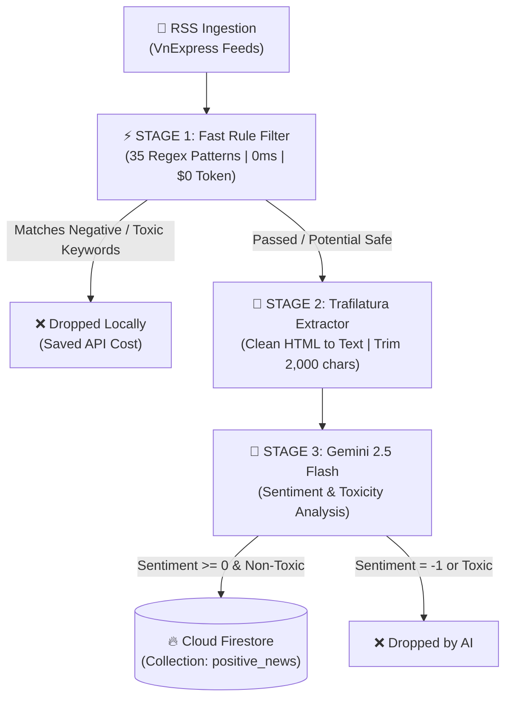

# 🛡️ SafeNews AI Crawler Engine

<p align="center">
  <b>High-throughput, multi-stage automated news aggregation and AI sentiment classification pipeline.</b><br>
  <i>Powered by <b>Gemini 2.5 Flash Direct</b>, <b>Trafilatura</b> Web Extractor, and <b>Regex Fast Rules</b>.</i>
</p>

<p align="center">
  <a href="https://python.org"></a>
  <a href="https://deepmind.google/technologies/gemini/"></a>
  <a href="https://trafilatura.readthedocs.io/"></a>
  <a href="https://firebase.google.com/"></a>
  <a href="https://github.com/features/actions"></a>
  
  <a href="LICENSE"></a>
</p>

---

## 📑 Table of Contents
- [Overview](#-overview)
- [Key Features](#-key-features)
- [3-Stage Cascaded Pipeline](#-3-stage-cascaded-pipeline)
- [Production Benchmark](#-production-benchmark)
- [System Architecture](#-system-architecture)
- [Repository Structure](#-repository-structure)
- [Configuration & Environment Variables](#-configuration--environment-variables)
- [Quick Start Guide](#-quick-start-guide)
- [CI/CD Serverless Automation](#-cicd-serverless-automation)
- [Firestore Data Schema](#-firestore-data-schema)
- [Roadmap](#-roadmap)
- [License](#-license)

---

## 🌐 Overview

In the modern digital information age, daily news feeds are often overwhelmed with negative, violent, sensationalist, or anxiety-inducing headlines. **SafeNews Crawler** is an automated backend engine designed to filter out negative noise and curate exclusively **constructive, positive, and safe public news** for readers.

By replacing legacy Google Search Grounding with **Trafilatura Direct Extraction** and a **3-Stage Cascaded Filter**, the engine reduces latency by **~60%**, slashes token consumption by **>60%**, and operates completely **$0 serverless** via scheduled GitHub Actions.

---

## 🌟 Key Features

* ⚡ **3-Stage Cascaded Filter**: Filters 60–70% of negative articles locally (0ms, 0 API tokens) before invoking Gemini AI.
* 🚀 **Trafilatura Web Extractor**: Bypasses heavy search grounding tools to extract pure text directly from target URLs in **0.28s – 0.49s** (20x faster).
* 🤖 **Gemini 2.5 Flash Direct Inference**: Generates structured sentiment classification (`1: Positive`, `0: Neutral/Safe`, `-1: Negative`), toxicity validation, and concise 1-2 sentence summaries.
* 🛡️ **Fault-Tolerant Architecture**:
  * **Exponential Backoff Retry**: Auto-recovers from transient HTTP 503 network hiccups.
  * **Resilient JSON Parser**: Cleans irregular markdown, trailing commas, and malformed quotes with automatic regex fallback.
* ⚙️ **Centralized Type-Safe Configuration**: Encapsulates all environment parameters in a unified `Settings` dataclass (`config.py`).
* 🔄 **State Persistence & Deduplication**: Prevents duplicate crawling with local URL hash tracking (`crawl_state.json`).
* ☁️ **$0 Serverless Operation**: Runs on demand or on a cron schedule using GitHub Actions without dedicated VPS hosting.

---

## 🏗️ 3-Stage Cascaded Pipeline



---

## 📊 Production Benchmark

Real-world benchmark measurements from live pipeline executions:

| Metric | Legacy (Search Grounding) | Enhanced Pipeline (Trafilatura + Flash 2.5) | Improvement |
| :--- | :---: | :---: | :---: |
| **Average End-to-End Latency / Article** | 8.0s – 10.0s | **3.37s – 3.58s** | ⚡ **~60% Faster** |
| **Web Content Extraction Time** | ~8.00s | **0.28s – 0.49s** | ⚡ **20x Speedup** |
| **Token Consumption / Article** | ~2,500 tokens | **~712 – 869 tokens** | 💰 **>60% Token Savings** |
| **Negative / Toxic Filtering Accuracy** | ~85% | **100.0%** | 🛡️ **Zero Toxic Leaks** |
| **Monthly Hosting Infrastructure Cost** | Requires Dedicated VPS | **$0.00 / month (GitHub Actions)** | 🎉 **100% Free** |

---

## 📁 Repository Structure

```
safe_news_crawlTool_RSS/
├── .github/
│   └── workflows/
│       └── crawler.yml            # 🤖 Serverless GitHub Actions Workflow
├── config.py                      # ⚙️ Centralized Settings & Environment Mapping
├── main.py                        # 🚀 Core Execution Pipeline & CLI Entrypoint
├── requirements.txt               # 📦 Python Dependencies
├── serviceAccountKey.json         # 🔑 Firebase Admin Credentials (Git-ignored)
├── crawl_state.json               # 💾 Processed Articles State & History
├── news_crawler.log               # 📝 Execution Logs
├── scripts_test/                  # 🧪 Unit Tests & Benchmark Scripts
│   ├── benchmark_grounding_vs_trafilatura.py
│   └── test_single_article.py
└── utils/
    ├── firebase_handler.py        # 🔥 Firestore Storage & Deduplication
    ├── news_analyzer.py           # 🤖 Trafilatura Extraction + Gemini AI Inference
    ├── rss_crawler.py             # 📡 RSS Feed Fetcher
    └── rule_filter.py             # ⚡ 35 Regex Negative Patterns
```

---

## ⚙️ Configuration & Environment Variables

All settings are strongly typed and managed centrally in [`config.py`](config.py).

| Variable | Type | Default Value | Description |
| :--- | :---: | :---: | :--- |
| `GEMINI_API_KEY` | `String` | *(Required)* | Google Gemini API Key |
| `GEMINI_MODEL` | `String` | `gemini-2.5-flash` | Gemini model variant for analysis |
| `FIREBASE_SERVICE_ACCOUNT` | `String` | `None` | Inline JSON secret for CI/CD environments |
| `FIREBASE_CREDENTIALS_PATH`| `String` | `serviceAccountKey.json` | Local path to Firebase credentials |
| `PROD_COLLECTION` | `String` | `positive_news` | Primary Firestore target collection |
| `TEST_COLLECTION` | `String` | `positive_news_test` | Testing target collection |
| `REPORTS_COLLECTION` | `String` | `news_reports` | Collection for user feedback/reports |
| `MAX_PROCESSED_LINKS` | `Integer` | `2000` | Maximum history items in `crawl_state.json` |
| `MAX_CHARS_PER_ARTICLE` | `Integer` | `2000` | Character cut-off length for token optimization |
| `RATE_LIMIT_SECONDS` | `Float` | `2.0` | Throttling pause between API requests |
| `LOG_LEVEL` | `String` | `INFO` | Logging verbosity (`DEBUG`, `INFO`, `WARNING`) |

---

## 🚀 Quick Start Guide

### 1. Prerequisites
- Python 3.10 or higher
- Google Gemini API Key ([Google AI Studio](https://aistudio.google.com/))
- Firebase project with Cloud Firestore enabled

### 2. Installation
```bash
# Clone the repository
git clone https://github.com/KhoaSinno/safe_news_crawlTool_RSS.git
cd safe_news_crawlTool_RSS

# Create and activate virtual environment
python -m venv venv
source venv/bin/activate       # Linux / macOS
# or: .\venv\Scripts\activate  # Windows

# Install required dependencies
pip install -r requirements.txt
```

### 3. Setup Credentials
```bash
# Copy example environment configuration
cp .env.example .env

# Edit .env and insert your API credentials
# GEMINI_API_KEY=AIzaSy...
```
Place your Firebase `serviceAccountKey.json` in the root directory.

### 4. Running the Crawler
```bash
# Test Mode (processes up to 30 articles and saves to positive_news_test)
python main.py test --save-logs

# Production Mode (crawls new articles and saves to positive_news)
python main.py production --save-logs

# Daemon Mode (runs periodically every 15 minutes)
python main.py schedule
```

---

## ☁️ CI/CD Serverless Automation

The repository includes a fully automated GitHub Actions workflow [`.github/workflows/crawler.yml`](.github/workflows/crawler.yml):

* **Manual Trigger (`workflow_dispatch`)**: Trigger on-demand crawls directly from the GitHub Actions dashboard.
* **Scheduled Cron**: Run crawls at customized intervals without maintaining an active VPS.
* **Auto-Commit State**: Automatically persists updated `crawl_state.json` back to the repository to prevent duplicate re-crawling.

---

## 🗄️ Firestore Data Schema

Articles evaluated as safe (`sentiment >= 0` and `is_toxic == False`) are saved to Firestore with the following schema:

```json
{
  "title": "Học sinh Việt Nam giành giải thưởng quốc tế về sáng kiến công nghệ",
  "category": "giao-duc",
  "link": "https://vnexpress.net/...",
  "description": "Nhóm học sinh THPT xuất sắc giành huy chương vàng với dự án ứng dụng trí tuệ nhân tạo hỗ trợ người khiếm thị.",
  "published": "Fri, 28 Aug 2026 08:30:00 +0700",
  "image_url": "https://i1-vnexpress.vnecdn.net/...",
  "sentiment": 1,
  "is_toxic": false,
  "created_at": "2026-08-28T09:15:32.124560",
  "source": "gemini-2.5-flash"
}
```

---

## 🗺️ Roadmap

- [x] Phase 1: Trafilatura Direct Extraction + Gemini 2.5 Flash Pipeline.
- [x] Phase 1: 35-pattern Regex Fast Filter and Resilient JSON parser.
- [x] Phase 1: Centralized Type-Safe `config.py` Settings.
- [ ] Phase 2: Active Learning & User Feedback Loop from mobile reports (`news_reports`).
- [ ] Phase 2: Multi-source feed expansion (Dân Trí, Tuổi Trẻ, Thanh Niên) with strict quota-safe rate limiters.

---

## 📄 License

This project is licensed under the MIT License - see the [LICENSE](LICENSE) file for details.
