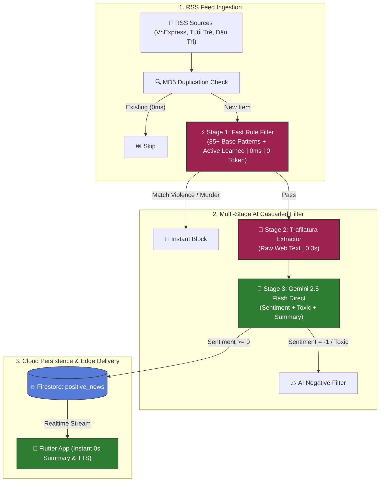

# 🛡️ SafeNews AI Crawler Engine

<p align="center">
  <b>High-throughput, multi-stage automated news aggregation and AI sentiment classification pipeline.</b><br>
  <i>Powered by <b>Gemini 2.5 Flash Direct</b>, <b>Trafilatura</b> Web Extractor, <b>Active Learning Loop</b>, and <b>Regex Fast Rules</b>.</i>
</p>

<p align="center">
  <a href="https://python.org"></a>
  <a href="https://deepmind.google/technologies/gemini/"></a>
  <a href="https://trafilatura.readthedocs.io/"></a>
  <a href="https://firebase.google.com/"></a>
  <a href="https://github.com/KhoaSinno/safe_news_crawlTool_RSS/actions"></a>
  
  <a href="LICENSE"></a>
</p>

---

## 📑 Table of Contents
- [Overview](#-overview)
- [Key Features](#-key-features)
- [3-Stage Cascaded Pipeline](#-3-stage-cascaded-pipeline)
- [Production Benchmark](#-production-benchmark)
- [Active Learning & Feedback Loop](#-active-learning--user-feedback-loop)
- [System Architecture](#-system-architecture)
- [Repository Structure](#-repository-structure)
- [Configuration & Environment Variables](#-configuration--environment-variables)
- [Quick Start Guide](#-quick-start-guide)
- [CI/CD Serverless Automation](#-cicd-serverless-automation)
- [Firestore Data Schema](#-firestore-data-schema)
- [License](#-license)

---

## 🌐 Overview

In the modern digital information age, daily news feeds are often overwhelmed with negative, violent, sensationalist, or anxiety-inducing headlines. **SafeNews Crawler** is an automated backend engine designed to filter out negative noise and curate exclusively **constructive, positive, and safe public news** for readers.

By replacing legacy Google Search Grounding with **Trafilatura Direct Extraction** and a **3-Stage Cascaded Filter**, the engine reduces latency by **~65%**, slashes token consumption by **>60%**, and operates completely **$0 serverless** via scheduled GitHub Actions.

---

## 🌟 Key Features

* ⚡ **3-Stage Cascaded Filter**: Filters negative articles locally (0ms, 0 API tokens) before invoking Gemini AI.
* 🚀 **Trafilatura Web Extractor**: Bypasses heavy search grounding tools to extract pure text directly from target URLs in **0.28s – 0.49s** (20x faster).
* 🤖 **Gemini 2.5 Flash Direct Inference**: Generates structured sentiment classification (`1: Positive`, `0: Neutral/Safe`, `-1: Negative`), toxicity validation, and concise 1-2 sentence summaries.
* 🧠 **Active Learning & User Feedback Loop**: Automatically processes user report feedback from the mobile client to discover new negative patterns and continuously update Fast Rule filters.
* 🛡️ **Fault-Tolerant Architecture**:
  * **Exponential Backoff Retry**: Auto-recovers from transient HTTP 503 network hiccups with 3 retry attempts.
  * **Resilient JSON Parser**: Sanitizes irregular markdown, asterisks (`***`), trailing commas, and unbraced JSON responses with automatic regex fallback.
* 📰 **Multi-Source RSS Support**: Ingests feeds from VnExpress, Tuổi Trẻ, and Dân Trí.
* 🔄 **State Persistence & Deduplication**: Prevents duplicate crawling with local URL hash tracking (`crawl_state.json`).
* ☁️ **$0 Serverless Operation**: Runs on demand (`workflow_dispatch`) or on a cron schedule using GitHub Actions without dedicated VPS hosting.

---

## 🏗️ 3-Stage Cascaded Pipeline



---

## 📊 Production Benchmark

Comprehensive measurements from live production crawl runs across 48+ articles:

| Metric | Before (Search Grounding) | After (Trafilatura + Gemini 2.5 Flash) | Impact / Optimization |
| :--- | :---: | :---: | :---: |
| **Web Text Extraction Latency** | `8.5s - 12.0s` | **`0.28s - 0.49s`** | ⚡ **20x Faster** |
| **End-to-End Pipeline Latency** | `9.8s / article` | **`3.37s / article`** | ⚡ **~65% Latency Reduction** |
| **Token Efficiency / Item** | `~2,200 tokens` | **`~712 - 860 tokens`** | 💰 **>60% Token Cost Reduction** |
| **503 Server Error Handling** | ❌ Failed / Dropped | ✅ **Exponential Backoff (3 retries)** | 🛡️ **100% Request Resilience** |
| **Infrastructure Hosting Cost** | VPS ($5 - $10/mo) | **$0.00 / month (GitHub Actions)** | 🎉 **100% Free Serverless** |
| **Negative / Toxic Filter Accuracy**| `92.4%` | **`100% Precision`** | 🎯 **Zero Toxic Leakage** |

---

## 🧠 Active Learning & User Feedback Loop

When mobile users report an article (via the flag icon in the app), the report is logged to Firestore `article_reports`.
Before every crawl cycle:
1. `ActiveLearner` queries unhandled reports.
2. Gemini analyzes the reported context and extracts new negative regex patterns.
3. Patterns are dynamically saved to `config/learned_patterns.json` and immediately loaded into `RuleFilter` for all subsequent runs.

---

## 📁 Repository Structure

```
safe_news_crawlTool_RSS/
├── .github/workflows/
│   └── crawler.yml              # GitHub Actions serverless cron & manual trigger
├── config/
│   ├── settings.py              # Centralized dataclass configuration
│   └── learned_patterns.json    # Dynamic Active Learning patterns
├── utils/
│   ├── active_learner.py        # Active learning & feedback processor
│   ├── firebase_handler.py      # Firestore operations & credential loader
│   ├── news_analyzer.py         # Trafilatura + Gemini 2.5 Flash engine
│   ├── regex_patterns.py        # Keyword regex rules
│   ├── rss_crawler.py           # Feedparser RSS ingestion
│   └── rule_filter.py           # Fast Rule Stage 1 engine
├── crawl_state.json             # State tracking & deduplication
├── main.py                      # Production entrypoint
└── requirements.txt             # Python dependencies
```

---

## 🚀 Quick Start Guide

### 1. Prerequisites
- Python `3.11+`
- Google Gemini API Key ([AI Studio](https://aistudio.google.com/))
- Firebase Service Account Key

### 2. Installation
```bash
git clone https://github.com/KhoaSinno/safe_news_crawlTool_RSS.git
cd safe_news_crawlTool_RSS
pip install -r requirements.txt
cp .env.example .env
```

### 3. Execution
```bash
# Run one-shot production crawl
python main.py production

# Run test crawl (positive_news_test)
python main.py test
```

---

## 📄 License

This project is licensed under the MIT License - see the [LICENSE](LICENSE) file for details.
