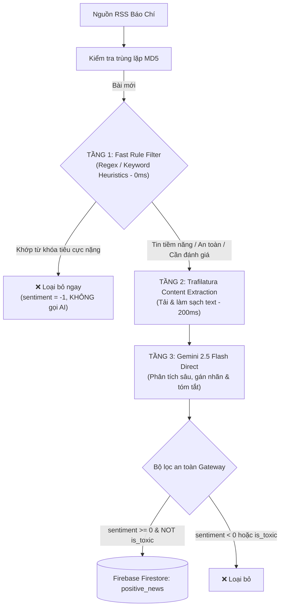

# Kế Hoạch Nâng Cấp Hệ Thống Crawler - Phase 1: Pipeline Optimization & Fast Filtering

> **Dự án**: Safe News Crawler & AI Analysis  
> **Phiên bản**: Phase 1 Enhancement  
> **Trọng tâm**: Tối ưu hóa tốc độ, giảm chi phí Token, tăng độ tin cậy bóc tách nội dung và bổ sung bộ lọc quy tắc nhanh (Fast Rule Filter).

---

## 🎯 1. Mục Tiêu Chính Của Phase 1

1. **Giảm 50% - 70% chi phí gọi Gemini API** bằng cách loại bỏ các bài báo tiêu cực hiển nhiên ở Tầng 1 (Fast Rule Filter).
2. **Tăng độ ổn định lên 100%** khi đọc nội dung bài báo mới bằng cách thay thế *Google Search Grounding* bằng thư viện **`Trafilatura`** (trực tiếp trích xuất HTML sạch).
3. **Giảm độ trễ trung bình** từ ~7–10s/bài xuống còn ~3–5s/bài.
4. **Chuẩn hóa quy trình ghi dữ liệu** vào Firebase Firestore với `serviceAccountKey.json`.

---

## 🏗️ 2. Kiến Trúc Pipeline Nâng Cấp (3 Tầng)

---

## 📋 3. Chi Tiết Các Hạng Mục Triển Khai

### 🔹 Hạng mục 1: Xây dựng Module `utils/rule_filter.py` (Tầng 1 - Fast Rule Engine)
* **Chức năng**:
  - Nhận vào tiêu đề (`title`) và phần mô tả ngắn từ RSS (`summary`).
  - Quét qua danh sách các mẫu Regex từ khóa nguy hiểm, tai nạn, án mạng nghiêm trọng.
* **Bộ từ khóa tiêu cực nặng (Extreme Negative Keywords)**:
  - *Án mạng / Bạo lực*: `giết người`, `án mạng`, `tử hình`, `truy nã`, `bắt khẩn cấp vì hành hung`, `đâm chết`, `chém người`.
  - *Thảm họa / Tai nạn*: `tử vong`, `chết người`, `thảm họa lũ quét`, `sạt lở vùi lấp`, `tai nạn liên hoàn`, `thiệt mạng`.
  - *Tệ nạn nghiêm trọng*: `đường dây ma túy`, `đánh bạc nghìn tỷ`, `buôn người`.
* **Cơ chế ngoại lệ (Whitelisting / Bypass)**:
  - Các bài có chứa cụm từ cảnh báo thủ đoạn giáo dục như *"cảnh báo lừa đảo"*, *"thủ đoạn chiếm đoạt"*, *"cách phòng tránh"* sẽ **không bị chặn ở Tầng 1** mà được chuyển tiếp sang AI để đánh giá giá trị giáo dục.

### 🔹 Hạng mục 2: Tích hợp `Trafilatura` vào `utils/news_analyzer.py` (Tầng 2 & 3)
* **Thay đổi kỹ thuật**:
  - Loại bỏ cấu hình `tools=[types.Tool(google_search=...)]` trong Gemini client config.
  - Sử dụng `trafilatura.fetch_url(url)` + `trafilatura.extract(...)` để bóc tách văn bản thân bài sạch, loại bỏ quảng cáo, menu, comment.
  - Cắt lấy tối đa 2.000 ký tự đầu tiên để nạp vào Prompt Gemini.
  - Cập nhật prompt: Truyền trực tiếp nội dung văn bản thật vào prompt thay vì yêu cầu Gemini dùng Search Tool.

### 🔹 Hạng mục 3: Cập nhật Luồng Điều Phối `main.py`
* Tích hợp `RuleFilter` vào trước bước gọi `NewsAnalyzer`.
* Bổ sung tracking thống kê chi tiết:
  - `total_crawled`: Tổng số bài từ RSS.
  - `filtered_by_rule`: Số bài bị loại ở Tầng 1 (tiết kiệm API).
  - `analyzed_by_ai`: Số bài gửi qua Gemini.
  - `stored_to_firebase`: Số bài tích cực/an toàn được lưu vào Firestore.

### 🔹 Hạng mục 4: Cập nhật `requirements.txt`
* Bổ sung package: `trafilatura>=2.2.0`.

---

## 🧪 4. Kế Hoạch Kiểm Thử & Nghiệm Thu (Verification)

1. **Test Unit Tầng 1**: Chạy thử `test_rule_filter.py` với danh sách 20 tiêu đề (10 tiêu cực, 5 tích cực, 5 cảnh báo trung tính) để kiểm tra độ chính xác của Regex.
2. **Test Toàn Trình 30 Bài Báo Mới**:
   - Chạy `main.py` trên 30 bài báo thực tế từ VnExpress.
   - Kiểm tra log thống kê:
     + Đảm bảo tỷ lệ loại bài ở Tầng 1 đạt **30% - 50%**.
     + Đảm bảo 100% bài chuyển sang Tầng 2 bóc tách được nội dung không bị rỗng.
     + Kiểm tra dữ liệu được ghi chuẩn vào collection Firestore `positive_news_test`.

---

## 📅 5. Trạng Thái & Các Bước Thực Hiện

- [x] Đã kiểm tra kết nối Gemini API và Firebase Admin Key.
- [x] Đã hoàn thành Benchmark chứng minh hiệu quả của `Trafilatura` so với `Search Grounding`.
- [ ] **Bước 1**: Tạo file `utils/rule_filter.py`.
- [ ] **Bước 2**: Refactor `utils/news_analyzer.py` chuyển sang Trafilatura direct extraction.
- [ ] **Bước 3**: Cập nhật `main.py` kết nối toàn bộ pipeline 3 tầng.
- [ ] **Bước 4**: Chạy test kiểm thử toàn trình 30 bài báo và xuất báo cáo kết quả.

